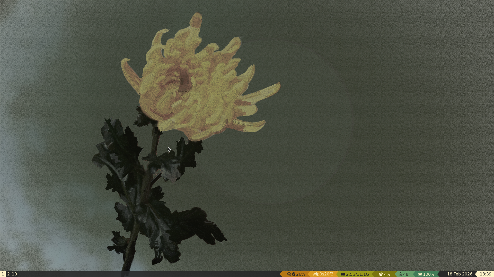
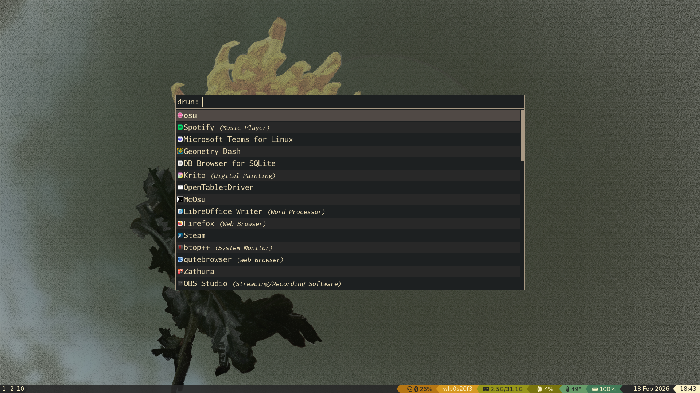
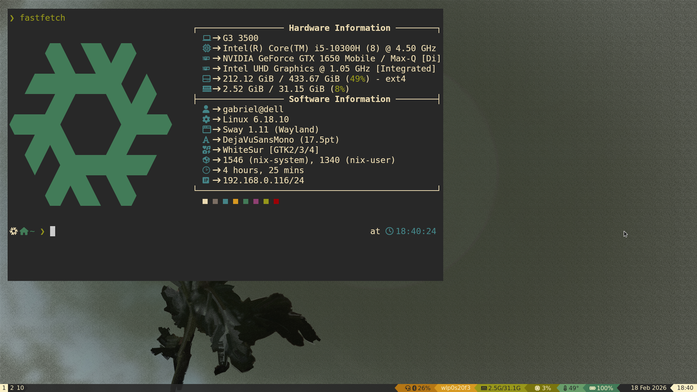
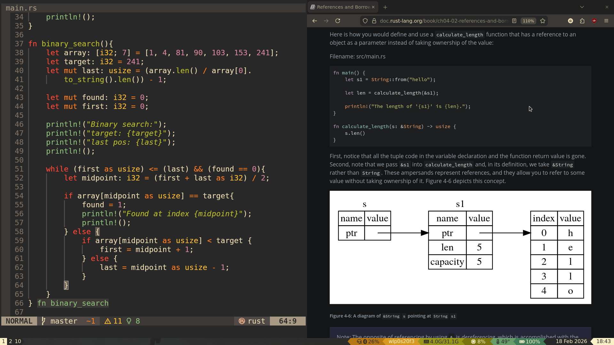

# My NixOS config:
> Colour scheme = Gruvbox
> Dotfile management = Home-manager\
> Display manager = tuigreet (greetd)\
> Window manager = Sway (wayland)\
> Bar = Waybar\
> Terminal = Kitty\
> Shell = zsh\
> Text editor = Neovim\
> Info-fetcher = Fastfetch 
> App launcher = Rofi

## Showcase

## IMPORTANT
- Back up your previous config before using anything from here.
- Generate/use your own `hardware-configuration.nix`, and ensure that flakes are enabled 
  before using this config.
- If you have a different user name (that isn't "gabriel"), swap out the "gabriel"s 
  in the [`install.sh`, `nixos/configuration.nix`, `nixos/update.sh`] to your own.
- Read scripts before use; they're all short, and it's good practice.

## Location
- All files and dirs go to `~/.config`,
- and `nixos/` is a mirror of `/etc/nixos` (hence the scripts).

## Extra
- To disable the boot menu, use `shift+t ` in the menu until the timeout is 0.
- If you execute install.sh (`./install.sh`), it'll move all the files to their place, 
  and install the config using the flake. 

## Credits:
Waybar config = [mxkrsv/dotfiles-old](https://github.com/mxkrsv/dotfiles-old/tree/master/.config/waybar)
*(I ported the config to nix, changed the colour scheme and order)*

Colour scheme = [hmorhetz/gruvbox](https://github.com/morhetz/gruvbox)
*(Used extensively lol)*

Wallpapers = [exorcist/wallpapers](https://codeberg.org/exorcist/wallpapers)

