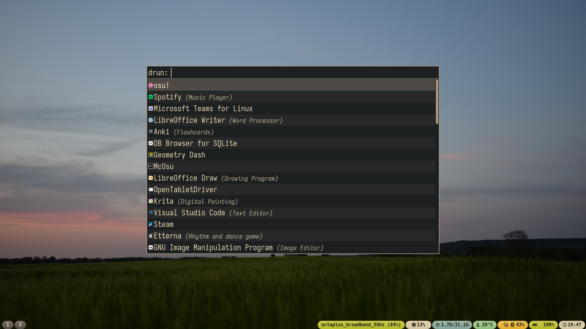
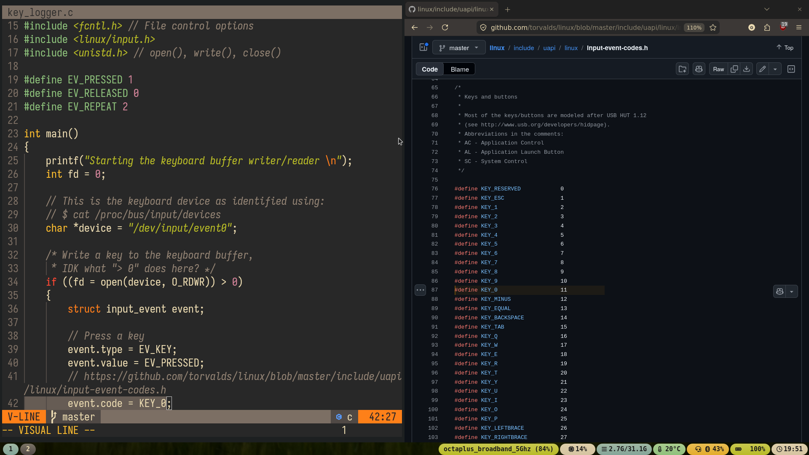

# My NixOS config:

> Colour scheme: Gruvbox\
> Dotfile management: Home-manager\
> Display manager: tuigreet (greetd)\
> Window manager: Sway (wayland)\
> Bar: Waybar\
> Terminal: Kitty\
> Shell: zsh\
> Text editor: Neovim\
> App launcher: Rofi\
> Info-fetcher: Fastfetch 

## IMPORTANT!
- Make sure that you have flakes enabled on your machine.

- Don't use the `hardware-configuration.nix`s included in this repo;
  they're not generated for your hardware. Instead, use your own generated 
  during installation or make a new copy with `$ nixos-generate-config`.

- Read any scripts before use; they're all short, and it's good practice.

- The scripts include commands for: updating/installing the config and 
  removing redundanct versions of packages.

## Location
- You can clone this repo and it should be usable from any location.

- I have it at `~/` for easy access.

## Extra
- To disable the boot menu, use `shift+t ` in the menu until the timeout is 0.
  and install the config using the flake. 

## Credits:
- Waybar config: [mxkrsv/dotfiles-old](https://github.com/mxkrsv/dotfiles-old/tree/master/.config/waybar)
*(I ported the config to nix, changed the colour scheme and order)*

- Colour scheme: [hmorhetz/gruvbox](https://github.com/morhetz/gruvbox)
*(Used extensively lol)*

- Wallpapers: 
> [exorcist/wallpapers](https://codeberg.org/exorcist/wallpapers)
> [nasa image-of-the-day](https://www.nasa.gov/image-of-the-day/)

### $ tree 
`
.\
├── dev\
│   └── `# Any nix dev shells go here`\
├── flake.lock\
├── flake.nix `# Inputs and outputs; connects everything`\
├── home.nix `# Declares inputs and short cross-host statements`\
├── hosts\
│   ├── desktop\
│   │   └── default.nix `# Declares inputs and short statements specific to host`\
│       └── hardware-configuration.nix\
│   └── laptop\
│       ├── default.nix\
│       └── hardware-configuration.nix\
├── modules\
│   ├── home-manager `# Where the files input by home.nix are`\
│   │   ├── *.nix\
│   └── nixos `# Pool of configs that can be used by hosts`\
│       ├── common.nix `# Any short statements I want to use between hosts`\
│       └── (something specific)*.nix\
├── nixpkgs `# Old config related to manually building packages for testing`\
│   └── config.nix\
└── update.sh`
