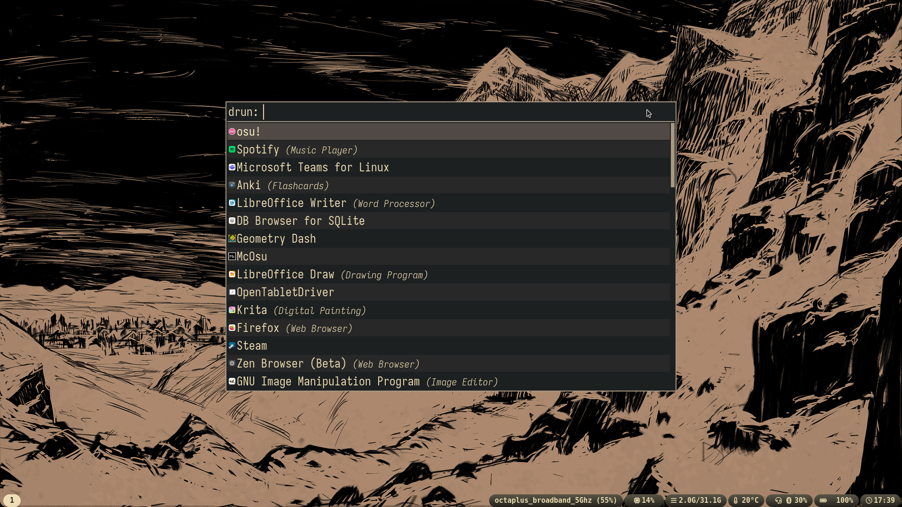

# My NixOS config:

> Colour scheme: Gruvbox (with custom background colour)\
> Dotfile management: Home-manager\
> Display manager: tuigreet (greetd)\
> Window manager: Sway (wayland)\
> Bar: Waybar\
> Terminal: Kitty\
> Shell: zsh\
> Text editor: Neovim\
> App launcher: Rofi\
> Wallpaper utility: awww\
> Corners: Quickshell

## IMPORTANT!
- Make sure that you have flakes enabled on your machine.

- Don't use the `hardware-configuration.nix`s included in this repo,
  they're not generated for your hardware. Instead, use your own version 
  created during installation or make a new copy (`$ nixos-generate-config`).

- Read any scripts before use; they're all short, and it's good practice.

- The scripts include commands for: updating/installing the config and 
  removing redundanct versions of packages.

## Location
- You can clone this repo and it should be usable from any location,
- the only thing affected by the location is the `up` alias I made.
- I personally have it at `~/`. 

## Extra
- To disable the boot menu, use `shift+t ` in the menu until the timeout is 0.
  and install the config using the flake. 

## Credits:
- Colour scheme: [hmorhetz/gruvbox](https://github.com/morhetz/gruvbox)
*(Used extensively)*

- Waybar config: [DreamMaoMao/mango-config](https://github.com/DreamMaoMao/mango-config)
*(I ported the bar to nix and adjusted it)*
