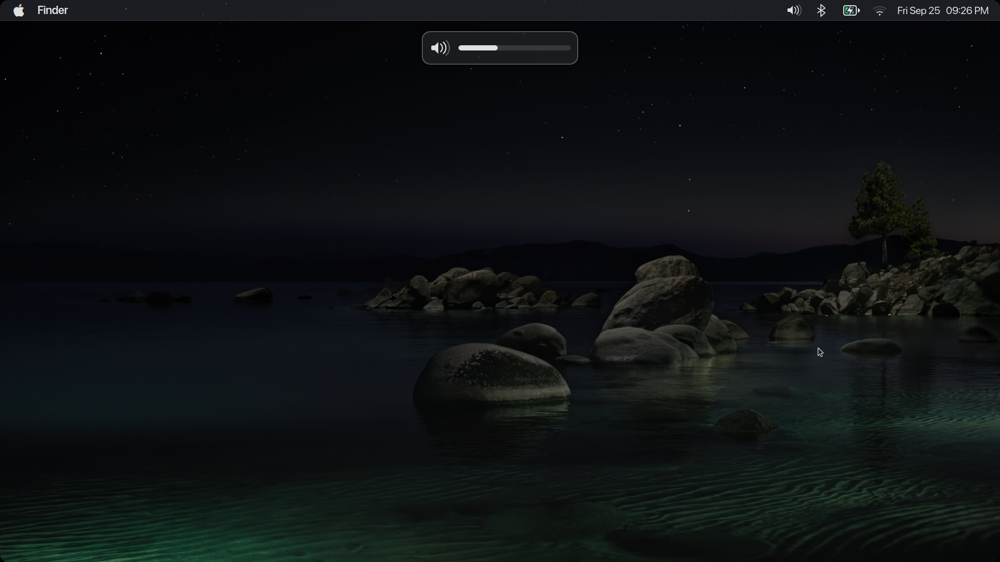
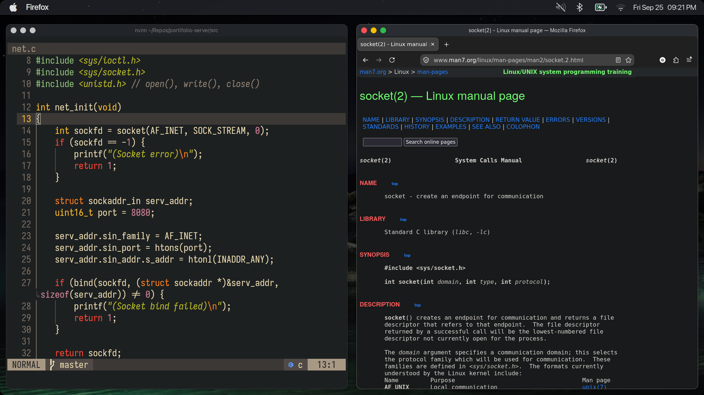

# My NixOS config:

|               |               |
| ------------- |:-------------:|
| colour scheme | [kaolin-blossom](https://github.com/c6rg0/kaolin.nvim) |
| operating system | nixos |
| dotfile management | home-manager |
| display manager | tuigreet (greetd) |
| window manager | swaywm (wayland) |
| bar | waybar |
| terminal emulator | kitty |
| shell | zsh |
| app menu | rofi |
| wallpaper utility | awww |
| corners | quickshell |

## IMPORTANT!
- Make sure that you have flakes enabled on your machine.

- Don't use the `hardware-configuration.nix`s included in this repo,
  they're not generated for your hardware. Instead, use your own version 
  created during installation or make a new copy (`$ nixos-generate-config`).

- Read any scripts before use; they're all short, and it's good practice.

- The scripts include commands for: updating/installing the config and 
  removing redundanct versions of packages.

## Location
- The repo works if it's located at `/home/$(whoami)/System/`.

## Extra
- To disable the boot menu, use `shift+t ` in the menu until the timeout is 0.
  and install the config using the flake. 

## Credits:
- Waybar config: [DreamMaoMao/mango-config](https://github.com/DreamMaoMao/mango-config)
*(I ported the bar to nix and adjusted it)*

